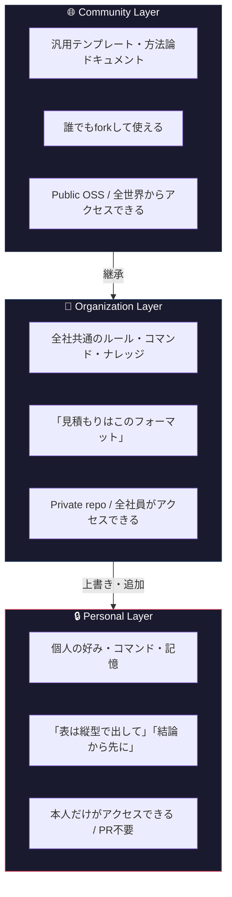

# 「うちの社員、全員バラバラにAI使ってるんだけど」

最近、こんな相談をもらうことが増えた。

> ChatGPTを入れたけど、各自が好き勝手に使ってて、ナレッジが全然溜まらない

> 誰がAIに何を聞いてるか見えない。コストも把握できてない

> エンジニアは使いこなしてるけど、営業や総務はほぼ触ってない

この話、どこかで聞いたことがある。

## 15年前にも同じことが起きていた

2010年頃。Gitは普及していたけど、チーム開発は混乱していた。

- 各自が好き勝手にブランチを切る
- マージのルールが決まっていない
- 誰がどのブランチで何をしているか把握できない
- 新人が入るたびに「うちのブランチ運用」を口頭で説明する

そこにVincent Driessenが **Git Flow** を提案した。ブログ記事1本で。

「mainとdevelopを分けろ。featureブランチはこう切れ。releaseはこうマージしろ」

たったこれだけのルールで、世界中の開発チームに秩序が生まれた。

## 今、AIの運用で同じ混乱が起きている

2026年現在。Claude CodeやChatGPTは十分に強力になった。でも問題は、個人で使うぶんには便利だけど、組織で使おうとするとカオスになるということ。

| Git以前 | AI以前（今の多くの企業） |
|---|---|
| 各自がzipでソースを管理 | 各自がChatGPTに個人プロンプトを投げる |
| マージのルールがない | AIの使い方のルールがない |
| ナレッジが属人化 | プロンプトのノウハウが属人化 |
| 新人が入ると混乱 | AIの使い方を毎回口頭で教える |

Git Flowがブランチ管理に秩序を与えたのと同じように、AI運用にも秩序を与えるルールが要る。

それが **Claude Code Flow** という考え方。

---

# Claude Code Flow って何

Claude Code Flowは、組織でClaude Code（+ MCP）を回すためのルール設計の考え方。

ひとことで言うと、**「AIの設定をどう分けて、どう管理するか」を決めたもの**。

Git Flowが「ブランチの分け方」を決めたように、Claude Code Flowは **「AIの設定を、誰のために、どこに、どう置くか」** を決める。

---

# 一番大事なところ ── 3層分離

Claude Code Flowで一番重要な考え方がこれ。



> **読み込み順** Community → Organization → Personal
> **優先度** Personal > Organization > Community

### なぜ3層に分けるのか

分けなかったらどうなるか考えるとわかりやすい。

**1層（全部まとめて1つ）だと**
- 社長の個人的な健康管理コマンドが全社員に見える
- 新人がうっかりセキュリティルールを壊す
- 誰かの個人プロンプトが全社のデフォルトになってしまう

**2層（個人 + 全社）だと**
- 各社が同じようなセキュリティルールやコマンドをゼロから作る
- いいやり方が組織の外に出ていかない

**3層にすると**
- 個人の自由（Personal）と組織の秩序（Organization）が両立する
- 組織で磨いた資産をOSS化すれば、業界全体の底上げにもなる（Community）

---

# 非エンジニアはどうするのか ── デプロイパターン

「3層分離はわかった。で、総務の人はどうするの？」

ここがClaude Code Flowの2つ目のポイント。利用者の技術レベルに合わせて3つのパターンを用意する。

## Full（エンジニア向け）

```
ローカルにgit cloneして、CLIやVSCodeで直接Claude Codeを使う。
3層が物理的に分離している。

  ~/.claude/              → Personal（個人Git管理）
  ~/project/.claude/      → Organization（チームrepo）
  ~/project/shared/ccf/   → Community（submodule）
```

## Light（準技術者向け）

```
ローカルにcloneはするけど、CLIは使わない。
GitHub IssueやWeb UIで操作する。

  ~/.claude/              → Personal（ローカルに自然に溜まる）
  ~/project/.claude/      → Organization（clone済み）
```

## Zero（非エンジニア向け）

```
ローカルには何もインストールしない。
SlackかGitHub Issueだけで使う。

  Notion / Google Docs    → Personal（クラウド上の個人設定）
  GitHub Actions          → Organization（クラウド上で自動実行）
```

### Zeroパターンだと実際どうなるか

総務部の田中さんの場合。

```
田中さんのPCに入っているもの
  Chrome
  Slack
  以上。gitもVSCodeもClaude Codeも入ってない。

田中さんの使い方
  Slackで「@Claude 先月の交通費の仕訳教えて」と書く。

裏側で起きていること
  1. Slack → GitHub Actions が起動
  2. 全社ルールが入ったOrg repoがcheckoutされる
  3. 田中さんの個人設定（Notionから取得）も反映
  4. Claude APIが回答を生成
  5. Slackに返信が届く

田中さんの認識
  「SlackにAIアシスタントがいる」
  以上。3層もリポも知らない。知る必要もない。
```

方法論を理解しないといけないのはメンテナー（管理者）だけ。使う人はSlackで話しかけるだけでいい。これがClaude Code Flowの設計思想。

---

# ルール変更はどうやるのか ── 入口は複数、出口は1つ

組織のルールは変わる。コマンドも増える。じゃあ誰がどうやって変更するのか。

Claude Code Flowでは **入口は複数、出口は1つ** というやり方を採る。

```
入口（好きなものを使う）
  ① CLI で git branch        ← エンジニア
  ② GitHub Web UIで編集      ← ブラウザから直接
  ③ GitHub Issue で依頼      ← 日本語で書くだけ
  ④ Slack で一言             ← 一番カジュアル

     ↓ どの入口からでも

出口（ここに全部集まる）
  GitHub PR → レビュー → マージ
```

営業担当が「見積もりコマンドに消費税率のデフォルトを追加してほしい」と思ったら、

1. GitHub Issueのテンプレートに日本語で書く
2. `@claude` が自動でコードを修正してPRを作る
3. メンテナーがレビューしてマージ
4. 全員に反映される

営業担当はgitを知らなくていい。日本語で書くだけ。でもルール変更は必ずPRを通るから品質は担保される。

---

# 設定が競合したらどうなるのか

「個人の設定と全社の設定が矛盾したら？」

これはGit Flowにはなかった問題。Claude Codeは個人設定と全社設定の両方を読み込んで結合する。矛盾した場合、どっちが優先されるかはAI任せで不確定になる。

Claude Code Flowではここを明示的に決める。

| 優先 | カテゴリ | 例 |
|---|---|---|
| 全社が絶対優先 | セキュリティ、言語、API管理 | 「APIキーをハードコードするな」 |
| 個人を尊重 | トーン、フォーマット、ワークフロー | 「表は縦型で出して」 |

さらに、全社ルールの強制度を2段階に分ける。

- **Soft Rule** …… CLAUDE.mdに書いて誘導。AIの判断で適用。だいたい守られる
- **Hard Rule** …… git hooksやCIで技術的に強制。100%破れない

セキュリティはHard Rule。スタイルの好みはSoft Rule。この使い分けが大事。

---

# メンテナーって何をするのか

Claude Code Flowにはメンテナーという役割がある。Git Flowでいうリリースマネージャーみたいなもの。

**やること**
- PRのレビューとマージ（週1〜2回、30分くらい）
- 月1回の棚卸し（使われてないコマンドの整理、ナレッジの更新）
- 新しいメンバーが入ったときの初期設定
- 緊急時の対応（APIキーが漏れたときなど）

**やらなくていいこと**
- 個人設定の管理（各自でやってもらう）
- コマンドの中身を一から書く（利用者がPRするか、Claudeが自動生成する）
- 日常のAI利用のサポート（ドキュメントで解決する）

工数は週1時間くらい。PRの大半はClaudeが自動生成したものを「問題ないな」と確認するだけ。

| 組織の規模 | メンテナー体制 |
|---|---|
| 〜10人 | 1人（CTOか代表） |
| 10〜30人 | 1人 + 部署リーダーが自分の領域を分担 |
| 30人〜 | 専任 or チーム |

---

# 実際に回してみてどうだったか

自社（AIM LLC、北海道の10人くらいのIT企業）でClaude Code Flowを回した結果を書く。

## Before

- 代表の自分だけがClaude Codeを使いこなしていた
- 55個のコマンド、47のスキル定義が自分のマシンに閉じていた
- 他のメンバーは「ChatGPTに適当に聞く」という状態
- ナレッジは自分の頭の中。完全に属人化していた
- 月額コストは把握できていなかった

## After

- 営業部はGitHub Issueから提案書の下書きを依頼できるようになった
- 管理部はSlackで @Claude に経理の質問を投げられるようになった
- 開発部はVSCode拡張でコードレビューを回している
- ナレッジはOrg repoのknowledge/に蓄積して検索できる状態
- コストは月3〜4万円で全社が使えている

## 数字で見ると

| 指標 | Before | After |
|---|---|---|
| AIを使っている社員 | 1人 | 全員 |
| 共有コマンド数 | 0 | 43 |
| 提案書の作成時間 | 4〜6時間 | 1〜2時間 |
| 月額AIコスト | 把握できてなかった | 約$250で可視化済み |

---

# やってはいけないこと

Claude Code Flowを入れる前に、よくある失敗パターンを知っておいてほしい。

**1. 全員にAPIキーを配る**
退職時に回収を忘れる。コストが際限なく膨らむ。誰が何に使ったか追えない。プロキシ経由で一元管理する。

**2. 部署ごとに別のAIツールを入れる**
開発部はClaude、営業部はChatGPT、管理部はGemini。ナレッジが散らばってコストは3倍。1つの基盤にまとめる。

**3. プロンプトを個人任せにする**
品質がバラバラ。退職したら消える。同じようなプロンプトを何人も作る。commands/で標準化してGitで管理する。

**4. 最初から全部作り込む**
半年かけて完璧な基盤を作って、結局誰も使わない。Week 1で最小構成を動かして、使いながら育てていく。

---

# 始め方

## Week 1 ── 最小構成

1. GitHub Organizationを作る（既存のものでもいい）
2. Private repoを1つ作る（`{会社名}-workspace` など）
3. `.claude/CLAUDE.md` に全社ルールを書く
4. `.claude/commands/` に部署別のコマンドを置く
5. Issueで `@claude テスト` と書いて動くか確認する

ここまで1日あればできる。

## Week 2 ── 全社に広げる

1. 部署ごとのコマンドを `commands/{部署}/` に追加
2. CODEOWNERSで部署リーダーを設定
3. 非エンジニアにSlack or Issueの使い方を説明する（5分で終わる）

## Week 3以降 ── 育てる

- 使いながらコマンドを増やす
- 個人で作って良かったものをOrgに昇格させる（PRを出す）
- 月1回の棚卸しで要らないものを整理する

---

# おわりに

Claude Code Flowは大したフレームワークじゃない。

**「AIの設定を3層に分けて、PRで管理する」。それだけ。**

Git Flowが「ブランチをこう分けろ」と言っただけで世界中の開発に秩序が生まれた。Claude Code Flowも「設定をこう分けろ」と言うだけで、組織のAI運用に秩序が生まれる。

テンプレートリポジトリ（.claude/の雛形、GitHub Actions設定、Issueテンプレート等）はOSSで公開準備中。公開したらこの記事にリンクを追記する。

興味がある方はコメントかXで反応をもらえると嬉しい。

:::message
**続編を書きました**: [あなたのClaude Code設定は何点？ ── 10カテゴリ100点満点で採点する](https://zenn.dev/aim_kimura/articles/claude-code-scorecard)
自分の環境を10カテゴリで採点できるスコアカードを公開しています。まずは自分の現在地を知るところから。
:::

---

*Claude Code FlowはAIM LLC（北海道）が提案するオープンな方法論です。MIT License。*